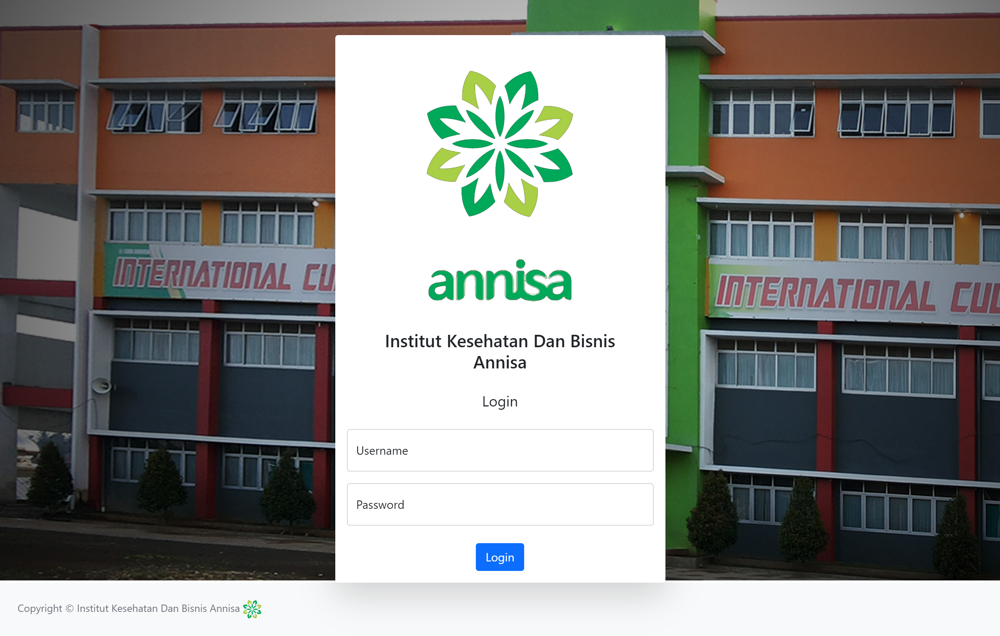
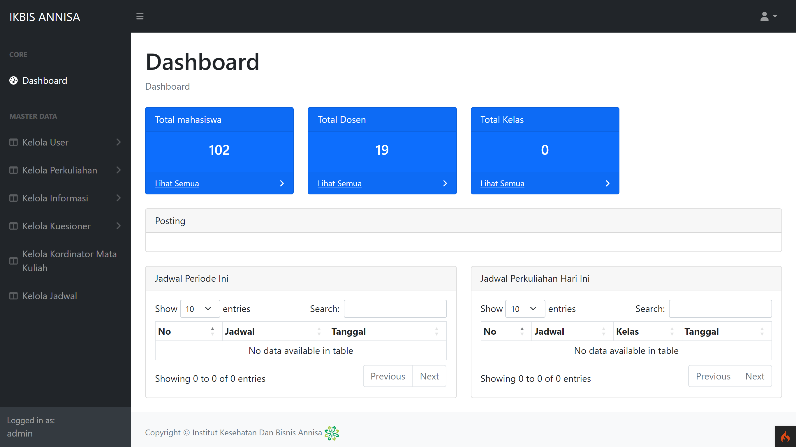
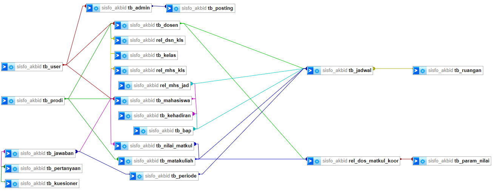

# Ikbis Annisa (formerly Sisfo Akbid)

## Contents
- [Skema Database](#skema-database)
- [Fitur Utama](#fitur-utama)
- [Rekomendasi Kebutuhan Sistem](#rekomendasi-kebutuhan-sistem)
- [Instalasi](#instalasi)
- [Troubleshooting: PHP Extension Error](#troubleshooting-php-extension-error)
- [Import Database](#import-database)

**Ikbis Annisa** adalah sistem informasi akademik yang dibangun menggunakan CodeIgniter4. Web ini menyediakan berbagai fitur untuk management learning di kampus dengan empat tipe pengguna: Admin, Dosen, dan Mahasiswa. 




## Skema Database
Aplikasi ini menggunakan database yang dirancang secara khusus untuk memenuhi kebutuhan pengelolaan koperasi, dengan berbagai tabel yang saling berelasi untuk memastikan integritas data.



## Fitur Utama
Aplikasi ini menawarkan fitur-fitur lengkap yang disesuaikan dengan peran pengguna:
- login admin, mahasiswa, dan dosen
- kelola master data oleh admin (user, mata kuliah, ruangan, periode, kuesioner, postingan blog)
- kelola status koordinator dosen oleh admin pada dosen
- plottingan mahasiswa baru kedalam kelas baru oleh admin
- plottingan dosen wali kedalam kelas oleh admin
- plottingan jadwal oleh admin (set matakuliah, dosen, ruangan, jam, hari)
- registrasi matakuliah oleh mahasiswa
- koordinator dosen mengelola parameter nilai matakuliah yang dipegang
- dosen generate BAP (open BAP, cek kehadiran, close)
- dosen memberi nilai ke mahasiswa

## Rekomendasi Kebutuhan Sistem
Agar aplikasi ini dapat berjalan dengan baik, berikut adalah kebutuhan sistem yang direkomendasikan:

- Composer - Dependency Manager untuk PHP. ([Download Composer](https://getcomposer.org/download/))
- MySQL 8.0 - Database server yang kompatibel. ([Download MySQL 8.0](https://dev.mysql.com/downloads/mysql/8.0.html))
- PHP 8.1 - Versi PHP yang didukung oleh CodeIgniter 4. ([Download PHP 8.1](https://www.php.net/downloads))

## Instalasi
Ikuti langkah-langkah berikut untuk menjalankan proyek ini di lingkungan lokal Anda:

1. Clone repositori ini: `git clone https://github.com/egn234/sisfo-akbid.git`
2. Masuk ke direktori proyek: `cd sisfo-akbid`
3. Install dependencies menggunakan Composer: `composer install`
4. Copy file env menjadi .env: `cp env .env`
5. Sesuaikan pengaturan database di file `.env` Anda sesuai dengan konfigurasi lokal Anda.
6. Jalankan server lokal: `php spark serve`

## Troubleshooting: PHP Extension Error

Jika aplikasi tidak berjalan dan muncul error terkait ekstensi PHP yang tidak ditemukan atau gagal, pastikan bahwa ekstensi yang diperlukan telah diaktifkan di dalam file konfigurasi `php.ini`. Ikuti langkah-langkah berikut untuk mengaktifkan ekstensi yang diperlukan:

1. **Buka file konfigurasi PHP (`php.ini`)**:  
   Lokasi file ini tergantung pada sistem Anda. Untuk sistem Linux, Anda bisa mencarinya di `/etc/php/8.1/apache2/php.ini` atau `/etc/php/8.1/cli/php.ini`. Untuk sistem Windows, biasanya ada di direktori instalasi PHP, seperti `C:\xampp\php\php.ini`.

2. **Aktifkan ekstensi yang diperlukan**:  
   Cari baris yang berkaitan dengan ekstensi yang dibutuhkan dan pastikan tidak ada tanda `;` (titik koma) di awal baris. Jika ada, hapus tanda tersebut untuk mengaktifkan ekstensi. Berikut adalah beberapa ekstensi umum yang dibutuhkan oleh CodeIgniter 4 dan aplikasi web pada umumnya:

   - `extension=intl`
   - `extension=mysqli`
   - `extension=mbstring`
   - `extension=curl`
   - `extension=json`
   - `extension=fileinfo`
   - `extension=openssl`
   
   Contoh:
   ```ini
   ;extension=intl
   ;extension=mysqli
   ;extension=mbstring
   ;extension=curl
   ;extension=json
   ;extension=fileinfo
   ;extension=openssl
   ```

   Setelah itu, hilangkan tanda `;` di awal baris:
   ```ini
   extension=intl
   extension=mysqli
   extension=mbstring
   extension=curl
   extension=json
   extension=fileinfo
   extension=openssl
   ```
restart server atau jalankan kembali spark untuk menjalankan konfigurasi php nya. Jika Anda masih menghadapi masalah terkait ekstensi, periksa dokumentasi PHP di [php.net](https://www.php.net/manual/en/).

### Import Database
Untuk mengimpor skema database, silakan gunakan file SQL yang telah disediakan di direktori berikut:

`app/database/sisfo_akbid.sql`

inisiasi user untuk admin, ketua, dan bendahara adalah sebagai berikut:
- username admin: administrator
- password default: administrator

---

> Proyek ini terus diperbarui untuk memastikan kinerja optimal dan penambahan fitur baru sesuai dengan kebutuhan pengguna. Jika Anda memiliki saran atau menemukan masalah, jangan ragu untuk membuka *issue* atau *pull request*.
